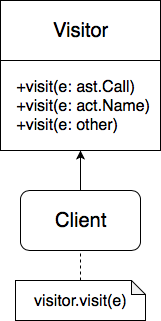

# Поиск паттернов в open-source проектах

Для разбора я выбрал open-source систему для автоматической развёртки программного обеспечения [Ansible](https://github.com/ansible/ansible). Далее будет описано и объяснено использование различных паттернов проектирования в коде этой системы. Выбранный мною проект реализован на языке Python.

## Singleton

Начнём с простого: паттерн Singleton (реализованный [тут](https://github.com/ansible/ansible/blob/ea6e96985a976f7bae703964e00028aef5fed218/lib/ansible/utils/singleton.py)) используется в классе [**Display**](https://github.com/ansible/ansible/blob/ea6e96985a976f7bae703964e00028aef5fed218/lib/ansible/utils/display.py) как единая точка обращения к средствам вывода сообщений,
тем самым моделируя единственный в реальности устройство для вывода информации.

## Visitor

Далее кое-что поинтереснее: в классе [**CleansingNodeVisitor**](https://github.com/ansible/ansible/blob/8555b728c3394c3ee9c906f79c7e63bf5ca6f0d0/lib/ansible/template/safe_eval.py) для обхода дерева применяется паттерн Visitor: узел передаётся в метод `visit()`, после чего требуемое действие определяется на основе типа узла.

(логика `e.accept(visitor)` вынесена наружу)

## Adapter

Для поддержки легаси-версий Windows в проекте применяется паттер Adapter (функция [**Get-NetAdapterLegacy**](https://github.com/ansible/ansible/blob/945e35ada2c76b3c410fe75ef197db0a88c9de5d/lib/ansible/modules/windows/win_dns_client.ps1)), которая инкапсулирует преобразования аргументов, необходимые для работы с устаревшими ОС.

## Iterator

Для обхода хостов в классе [**StrategyModule**](https://github.com/ansible/ansible/blob/51b33b79c0f2a3dea0ba30f6278ec4d538b5b623/lib/ansible/plugins/strategy/free.py) применяется итератор, что позволяет инкапсулировать логику хранения хостов, после чего для доступа к ним достаточно вызова `self.get_hosts_left(iterator)`.